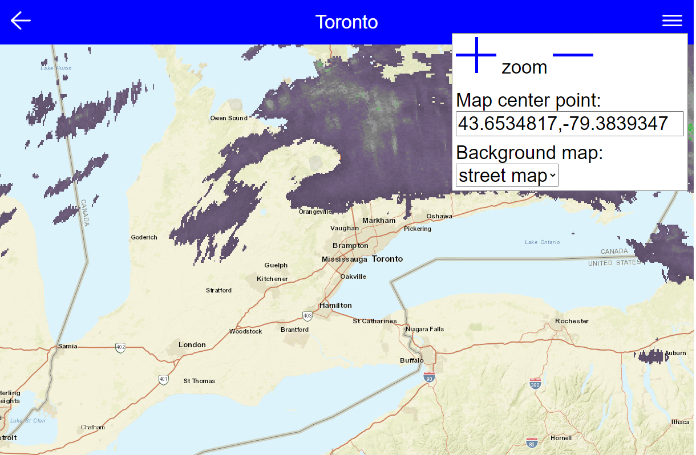

# MC74.mp -- Configuration Object for reviveMC74 app

A VOIP application to revive the MC74 that was withdrawn and abandoned by Cisco/Meraki.
This package contains code and instructions on how to (more or less) automatically root
an MC74 and install the new Android apps to allow the phone to be used on any VOIP
provider.

### Prerequisites

Aside from an MC74 and a host computer (with Python), you need:

* POE (Power Over Ethernet) power injector or switch port
* Ethernet cable
* USB A to USB A (host connector on both ends)
* 'git clone' this reviveMC74 repository to host computer

The reviveMC74 git repository contains any needed scripts, disk images, applications
or other files -- or will attempt to download them from the internet.  The first thing
reviveMC74.py does is verify that all the needed files are in the repo's 'installFiles'
directory.

Get a copy of the repo. In a command prompt, 'cd' to the directory where you want the 
repo.  This is where all the revival programs and backed-up image files and stuff
will be kept.

    git clone https://github.com/reviveMC74/reviveMC74.git
    cd reviveMC74

### MC74.mp object Contents and Format
The MC74.mp file is a configuration file, sort of like a .XML file but with a simpler format.
It contains sections for defining or configuring various parts of the MC74 software, such as:
* the list of buttons on the left side of the screen
* the menu items on the menu that 'slides' out from the left of the screen
* the background images
* voicemail servers and passwords
* location information (ie for the weather radar page and forecast graph).

It is stored in the /sdcard/ssm/store directory along with other configuration objects, most of which are stored in a compact binary format called '.nob' files.  You 'adb pull' the file and edit it on your computer, and 'adb push' it back, or you can 'adb shell' and use 'vi' to edit it.

Notice that, like python programs the structure of the object is controlled by the indenting of
lines.  The case of entry or 'node' names (the part to the left of the colon) usualy does not matter.
By convention, then these config objects are interpreted, node with names that start with a minus
('-') are ignored.  This allows you nodes to be left in the file but effectively 'commented out'
 -- the 'contacts' button in the 'mainFooter' node is effectively disabled becaause of the '-' before 
name.

    TITLE: 'Meraki MC74 Config'
    bg: 'whiteSlate.jpg'
    config:
      screenSaver:
        img: "row.jpg"
        lightSleep: '600'
        deepSleep: '1200'
      ringtone: '/system/media/audio/ringtones/Trad.ogg'
      ringVibrate:
    swipe:
      inRight: 'ribo.ssm.Phone doKeyEvent BACK'
      outLeft: 'ribo.ssm.Phone doKeyEvent BACK'
      inTop: 'ribo.ssm.Phone doKeyEvent HOME' 
      inBottom: 'ribo.ssm.Phone doKeyEvent MENU' 
    mainFooter: ''
      history: ''
        act: 'org.linphone.history.HistoryActivity'
        img: 'footer_log'
      -contacts: ''
        act: 'org.linphone.contacts.ContactsActivity'
        img: 'footer_contacts'
      voicemail: ''
        act: 'ribo.phone.VoicemailAct'
        img: 'footer_voicemail'
      dialer: ''
        act: 'org.linphone.dialer.DialerActivity'
        img: 'footer_dialer'
      sms: ''
        act: 'ribo.phone.WebPanel'
        img: 'footer_sms'
        url: 'http://localhost:1808/smspanel'
    sideMenu: ''
      voipSettings: 'SIP address'
        img: 'menu_weather'
        act: 'ribo.phone.WebAct'
        cmd: 'http://localhost:1808/voipsettings'
      recordings: 'Recordings'
        img: 'menu_recordings'
        act: 'org.linphone.recording.RecordingsActivity'
      wRadar: 'Weather Radar'
        img: 'menu_weather'
        act: 'ribo.phone.WebAct'
        cmd: 'http://localhost:1808/weather/radar'
      wGraph: 'Weather Forecast Graph'
        img: 'menu_weather'
        act: 'ribo.phone.WebAct'
        cmd: 'http://localhost:1808/weather/graph'

When updated versions of the MC74 app are distributed, the MC74 object may be replaced -- destroying
any changes you made.  To allow these updates to occur without losing local updates, a second
object/file, named MC74local.mp can be used.  This file will never be replaced by any update -- and 
the information contained in MC74local is merged or 'overlayed' on top of the MC74 object.  Rename
the 'MC74local.mpSample' to 'MC74local.mp' and edit that file.  Here's an example:

    TITLE: 'Local config info, which is overlayed on MC74 object'
    config:
      ringtone: '/system/media/audio/ringtones/Trad.ogg'
      voicemailUserid: '(vois.ms api userid here)'
      voicemailPwd: '(api password here)'
    weather:
      latLong: '41.8239, -71.4128'
      map: 'aerial'
      zoom: '7'
   mainFooter:
     -sms

When the MC74local object is overlayed on the MC74 object:
* The '-sms' in the 'mainFooter' section in MC74 is deleted, removing that button 
* The 'voicemailUserid' and 'voicemailPwd' nodes are added to the 'config' node
* The background of the weather radar map is changed to aerial photographs and the map is 
zoomed out a bit.

### mainFooter and sideMenu Nodes

The 'mainFooter' and 'sideMenu' nodes contain subnodes that define each button or menu item.
('mainFooter' is a vestige of the softphone app being used on portrait mode phones, where the 
buttons were on bottom, or foot of the screen.  On the MC74 they appear on the left side of the
screen.)  The 'side menu' is accessed by draggin your finger from outside the left side of the
screen into the screen while the (MC74) phone app is visible.

The node below defines the a button phone screen.  The 'act' node contains the name of the 
android activity or other program that should executed when the button is pressed.  'img' contains
the name of the image (in the reviveMC74.apk 'assets/images' resource, or in a file store in
/sdcard/ssm/image, that is used as the icon for the button.

      mainFooter: ''
        history: ''
          act: 'org.linphone.history.HistoryActivity'
          img: 'footer_log'

The value of the 'history' node itself (which is shown as '', the null string here), is not used
for 'mainFooter' buttons; for 'sideMenu' nodes, the value of the node is the text displayed in 
the side menu entry.  (The '' can be omitted in the text version of an object, it is shown when 
a binary version of the object is rendered as text.)

### Weather Radar Page

The weather radar menu item on the left 'slide out' menu is defined be following part of the
MC74.mp configuration object:

    sideMenu: ''
      wRadar: 'Weather Radar'
        img: 'menu_weather'
        act: 'ribo.phone.WebAct'
        cmd: 'http://localhost:1808/weather/radar'

The default location for the map for the radar image is defined in another section of the MC74 object:

    weather:
      latLong: '41.8239, -71.4128'
      location: 'Boston'
      map: 'street'
      zoom: '8'

The 'latLong' entry specifies the latitude and longitude in degrees for the center point of the 
map image.  I use a location slightly to the south west of my location of interest because 
storms usually come in from that direction.

If latLong is omitted, the text in the 'location' entry use passed to (weather.gov, the website
that provides the weather info) to find the location.

The three horizontal lines button in the upper right displays or hides the weather menu (which is
shown open in the image above)  This menu allows you to temporarily move to other map locations,
to zoom in and out and to change the background map/aerial image.

### Weather Graph Page

The weather graph menu item on the left 'slide out' menu is defined be following part of the
MC74.mp configuration object:

    sideMenu: ''
      wGraph: 'Weather Forecast Graph'
        img: 'menu_weather'
        act: 'ribo.phone.WebAct'
        cmd: 'http://localhost:1808/weather/graph'

The 'weather' node described in the Weather Radar page is also used by the Weather Graph page.

